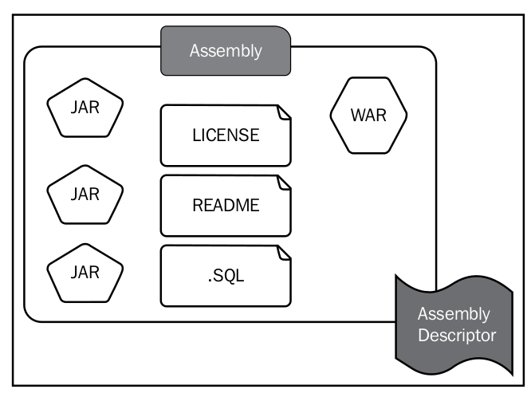

# Maven Assemblies

Maven provides an extensible architecture via plugins and lifecycles. Archive types such as `.jar` , `.war` , `.ear` , and many more are supported by plugins and associated lifecycles. 

The `JAR` plugin creates an artifact with the `.jar` extension and the relevant metadata, according to the JAR specification. The JAR file is, in fact, a `ZIP` file with the optional `META-INF` directory. You can find more details about the JAR specification from http://docs.oracle.com/javase/7/docs/technotes/guides/jar/jar.html.

The `JAR` file aggregates a set of class files to build a single distribution unit. The `WAR` file aggregates a set of JAR files, Java classes, JSPs, images, and many more resources into a single distribution unit that can be deployed in a Java EE application server.

However, when you build a product, you might need to aggregate many JAR files from different places, WAR files, README files, LICENSE files, and many more into a single ZIP file. To build such an archive, we can use the Maven `assembly` plugin.

The Maven `assembly` plugin produces a custom archive, which adheres to a user-defined layout. This custom archive is also known as the **Maven assembly**. In other words, it's a distribution unit, which is built according to a custom layout.

- The assembly plugin [Link](maven-assembly-plugin.md)
- The assembly descriptor [Link](the-assembly-descriptor.md)
- A runnable, standalong Maven Project [Link](a-runnable-standalong-maven-project.md)

