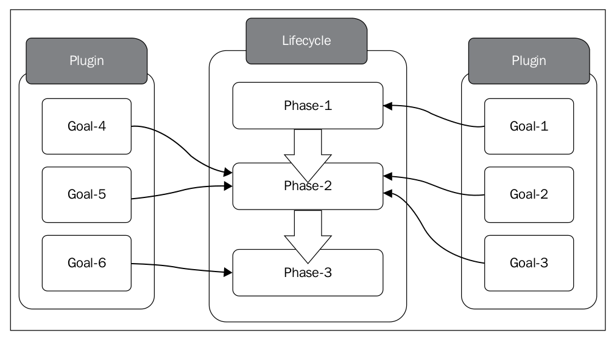

当初我学习的时候，真的搞不懂：

- 什么是生命周期，什么是phase
- 什么又是plugin的goal，
- 现在我知道了，就要把它讲明白。

需要搞明白的四个概念：

```txt
lifecycle
phase
goal
plugin
mvn command
```

```txt
lifecycle
phase 虚位以待(goal)，不能重名(lifecycle)
goal
plugin
mvn command
```

```txt
lifecycle
phase    --> mvn phase
goal     --> mvn plugin:goal
plugin
mvn command
```

The following figure shows the relationship between Maven plugin goals and lifecycle phases:



A Maven build **lifecycle** consists of a set of well-defined **phases**. 
Each **phase** groups a set of **goals** defined by Maven **plugins** and the lifecycle defines the order of execution.
A Maven **plugin** is a collection of **goals** where each goal is responsible for performing a specific action.

```txt
目的：说明生命周期是一个普遍存在的现象，生命周期分成不同的阶段。

成住坏空 宇宙

浮生一日，蜉蝣一生
人的生命周期(Life Cycle)，是指它的出生、成长过程、衰老、生病和死亡的过程。

「人的认识」人会长大三次。第一次是在发现自己不是世界中心的时候。第二次是在发现即使再怎么努力，终究还是有些事令人无能为力的时候。第三次是在，明知道有些事可能会无能为力，但还是会尽力争取的时候。

花的生命周期：准备生长——花芽——花蕾——含苞待放——鲜花怒放——残花败叶

企业/公司
```

- 5个核心概念：lifecycle/phase/goal/plugin/mvn command
- 生命周期是一个普遍存在的现象，每个生命周期有不同的阶段组成
- Maven提供的三个标准生命周期
- 三个生命周期是在哪里定义的呢？lifecycle和phase的关系是如何确立的呢？
- phase和goal之间的映射是怎么确立的呢？
- goal和plugin之间的关系是如何定义的呢？（非重点，后续讲plugin的时候，会讲到如何定义goal。）
- mvn command执行的两种方式
    - mvn phase
    - mvn plugin:goal


## 5个核心概念

- lifecycle
- phase
- goal
- plugin
- maven command

## lifecycle

- 3个标准生命周期 [Link](standard-lifecycle.md)
- 3个标准生命周期是如何定义的？ [Link](standard-lifecycle-definition.md)
- 生命周期phase与插件goal之间的对应关系 [Link](lifecycle-bindings.md)
- maven command [Link](maven-command.md)
- 自定义生命周期 [Link](build-a-custom-lifecycle.md)

## 运行

- 跳过测试 [Link](skip-test.md)
- 监测构建过程中JVM的变化 [Link](monitor-the-build.md)
