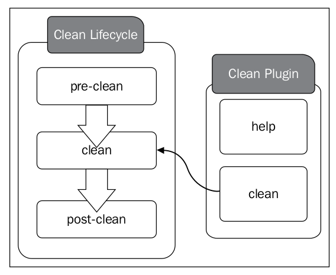
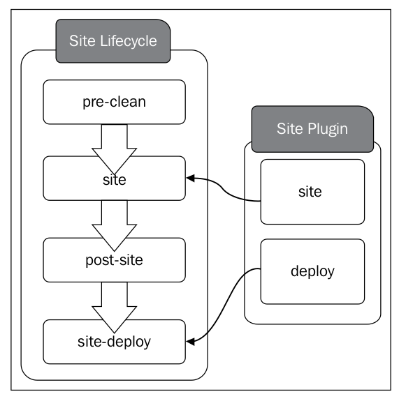
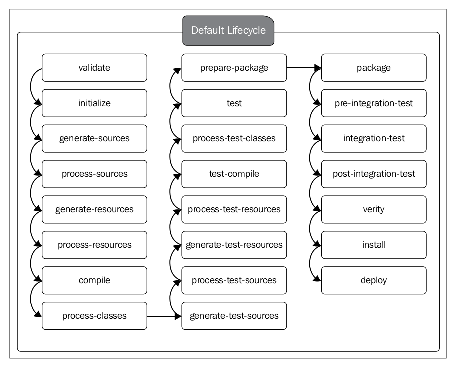

# Lifecycle bindings

```xml
lifecycle
phase    <!-- 本文关注 -->
goal     <!-- 本文关注 -->
plugin
mvn command
```

> The standard Maven lifecycles and their associated bindings are defined under the file `META-INF/plexus/components.xml` of `MAVEN_HOME/lib/maven-core-3.x.x.jar`. [Link](components-a.xml)

1\.  [Phase and Plugin Goals](#phaseandplugingoals)  
1.1\.  [Phase](#phase)  
1.2\.  [Plugin Goals](#plugingoals)  
1.3\.  [maven命令查看clean生命周期的绑定关系](#maven命令查看clean生命周期的绑定关系)  
1.4\.  [site lifecycle bindings](#sitelifecyclebindings)  
1.5\.  [maven命令查看site生命周期的绑定关系：](#maven命令查看site生命周期的绑定关系：)  
2\.  [Lifecycle Binding: `default`](#lifecyclebinding:`default`)  
2.1\.  [default lifecycle without bindings](#defaultlifecyclewithoutbindings)  
2.2\.  [packaging](#packaging)  
2.3\.  [packaging: jar](#packaging:jar)  
2.4\.  [packaging: war](#packaging:war)  

<a name="phaseandplugingoals"></a>

## 1\. Phase and Plugin Goals

<a name="phase"></a>

### 1.1\. Phase

A phase in a lifecycle is just **an ordered placeholder** in the build execution path. For example, the `clean` phase in the `clean` lifecycle cannot do anything on its own. When you type `mvn clean`, it cleans out project's working directory (by default, it's the `target` directory). This is done via **the Maven clean plugin**.

> 每个phase的本质是一个placeholder。

The `plugin goal` to `lifecycle phase` **mapping** can be provided through **the application `POM` file**. If not, it will be inherited from **the super POM file**. For example, The super POM file, which defines the `clean` plugin by default, adds the plugin to the `clean` phase of the `clean` lifecycle.

<a name="plugingoals"></a>

### 1.2\. Plugin Goals

To find more details about **the Maven clean plugin**, type the following command. It describes all the goals defined inside **the clean plugin**:

```bash
$ mvn help:describe -Dplugin=clean
```

Output:

```txt
Name: Apache Maven Clean Plugin
Description: The Maven Clean Plugin is a plugin that removes files generated
  at build-time in a project's directory.
Group Id: org.apache.maven.plugins
Artifact Id: maven-clean-plugin
Version: 3.1.0
Goal Prefix: clean

This plugin has 2 goals:

clean:clean
  Description: Goal which cleans the build.
    This attempts to clean a project's working directory of the files that were
    generated at build-time. By default, it discovers and deletes the
    directories configured in project.build.directory,
    project.build.outputDirectory, project.build.testOutputDirectory, and
    project.reporting.outputDirectory.
    
    Files outside the default may also be included in the deletion by
    configuring the filesets tag.

clean:help
  Description: Display help information on maven-clean-plugin.
    Call mvn clean:help -Ddetail=true -Dgoal=<goal-name> to display parameter
    details.

For more information, run 'mvn help:describe [...] -Ddetail'
```

Everything in Maven is a plugin. Even the command we executed previously to get goal details of **the clean plugin** executes another plugin: **the help plugin**. The following command will describe **the help plugin** itself: 

```bash
$ mvn help:describe -Dplugin=help
$ mvn help:describe -Dplugin=help -Ddetail # 查看更为详细的信息
``` 

describe is a goal defined inside **the help plugin**.

## Lifecycle Binding: `clean` 

### maven-clean-plugin goals

The Maven Clean Plugin is a plugin that removes files generated at build-time in a project's directory.

> maven-clean-plugin插件的作用

查看maven-clean-plugin定义的goals：

```bash
```

### clean lifecycle bindings

The `clean` lifecycle is defined with an associated plugin binding to the `clean` goal of `maven-clean-plugin`. The plugin binding is defined under the element `<default-phases>`. The code is as follows:

    <role>org.apache.maven.lifecycle.Lifecycle</role>
    <implementation>org.apache.maven.lifecycle.Lifecycle</implementation>
    <role-hint>clean</role-hint>
    <configuration>
        <id>clean</id>
        <phases>
            <phase>pre-clean</phase>
            <phase>clean</phase>
            <phase>post-clean</phase>
        </phases>
        <!-- 关注点 -->
        <default-phases>
            <clean>
                org.apache.maven.plugins:maven-clean-plugin:2.5:clean
            </clean>
        </default-phases>
    </configuration>
```

The following figure shows the relationship between **the Maven clean plugin goals**
and **the clean lifecycle phases**:



这里是通过打开**配置文件**的方式来查看phase与goal之间的绑定关系，下面介绍通过 **maven命令** 来查看phase与goal之间的绑定关系。

<a name="maven命令查看clean生命周期的绑定关系"></a>

### 1.3\. maven命令查看clean生命周期的绑定关系

通过两种辅助命令查看phase与goal之间的绑定关系：

 [<a href='function.fopen'>function.fopen</a>]: URL file-access is disabled in the server configuration in <b>D:\Inetpub\DomainID202296\localuser\problemsetmarmoset\latex\render.php</b> on line <b>73</b><br />
<br />
<b>Warning</b>:  fopen(http://quicklatex.com/latex3.f) [<a href='function.fopen'>function.fopen</a>]: failed to open stream: no suitable wrapper could be found in <b>D:\Inetpub\DomainID202296\localuser\problemsetmarmoset\latex\render.php</b> on line <b>73</b><br />
<br />
<b>Fatal error</b>:  Uncaught exception 'Exception' with message 'POST http://quicklatex.com/latex3.f failed: fopen(http://quicklatex.com/latex3.f) [&lt;a href='function.fopen'&gt;function.fopen&lt;/a&gt;]: failed to open stream: no suitable wrapper could be found' in D:\Inetpub\DomainID202296\localuser\problemsetmarmoset\latex\render.php:86
Stack trace:
#0 D:\Inetpub\DomainID202296\localuser\problemsetmarmoset\latex\render.php(43): rest_helper('http://quicklat...', 'formula= mvn he...', 'POST', 'text')
#1 D:\Inetpub\DomainID202296\localuser\problemsetmarmoset\latex\render.php(8): render_quicklatex(' mvn help:descr...')
#2 {main}
  thrown in <b>D:\Inetpub\DomainID202296\localuser\problemsetmarmoset\latex\render.php</b> on line <b>86</b><br />
 " mvn help:describe -Dplugin=clean```xml<!-- Lifecycle clean --><component></component>```bash mvn help:describe -Dcmd=clean")
```

第一个命令：

 [<a href='function.fopen'>function.fopen</a>]: URL file-access is disabled in the server configuration in <b>D:\Inetpub\DomainID202296\localuser\problemsetmarmoset\latex\render.php</b> on line <b>73</b><br />
<br />
<b>Warning</b>:  fopen(http://quicklatex.com/latex3.f) [<a href='function.fopen'>function.fopen</a>]: failed to open stream: no suitable wrapper could be found in <b>D:\Inetpub\DomainID202296\localuser\problemsetmarmoset\latex\render.php</b> on line <b>73</b><br />
<br />
<b>Fatal error</b>:  Uncaught exception 'Exception' with message 'POST http://quicklatex.com/latex3.f failed: fopen(http://quicklatex.com/latex3.f) [&lt;a href='function.fopen'&gt;function.fopen&lt;/a&gt;]: failed to open stream: no suitable wrapper could be found' in D:\Inetpub\DomainID202296\localuser\problemsetmarmoset\latex\render.php:86
Stack trace:
#0 D:\Inetpub\DomainID202296\localuser\problemsetmarmoset\latex\render.php(43): rest_helper('http://quicklat...', 'formula= mvn he...', 'POST', 'text')
#1 D:\Inetpub\DomainID202296\localuser\problemsetmarmoset\latex\render.php(8): render_quicklatex(' mvn help:effec...')
#2 {main}
  thrown in <b>D:\Inetpub\DomainID202296\localuser\problemsetmarmoset\latex\render.php</b> on line <b>86</b><br />
 " mvn help:effective-pom```bash mvn help:describe -Dcmd=clean")
```

Output:

```txt
'clean' is a lifecycle with the following phases: 

* pre-clean: Not defined
* clean: org.apache.maven.plugins:maven-clean-plugin:2.5:clean
* post-clean: Not defined
```

第二个命令：

```bash
```

The following code snippet shows how the `clean` goal of **the Maven clean plugin** is associated with the `clean` phase of the `clean` lifecycle:

    <artifactId>maven-clean-plugin</artifactId>
    <version>2.6.1</version>
    <executions>
        <!-- 关注点 -->
        <execution>
            <id>default-clean</id>
            <phase>clean</phase>
            <goals>
                <goal>clean</goal>
            </goals>
        </execution>
    </executions>
```

### phase: `clean`


这里可以看一下clean到底是做了什么呢？

### phase: `pre-clean` and `post-clean`

The objective of the `pre-clean` phase is to perform any operations prior to the cleaning task and the objective of the `post-clean` phase is to perform any operations after the cleaning task. 

> 两个phase的作用。

The `pre-clean` and `post-clean` phases of the `clean` lifecycle do not have any plugin bindings. 

> 两个phase没有任何plugin绑定。

If you need to associate any plugins with these two phases, you simply need to add them to the corresponding plugin configuration.

> 如果有需要，就使用它们两个phase。

我可以做一个播放音乐的功能，在开始之前播放一段音乐，在结束之后播放一段音乐。

## Lifecycle Binding: `site` 

### maven-site-plugin goals

The `site` plugin is used to generate static HTML content for a project. The generated HTML content will also include appropriate reports corresponding to the project.

> maven-site-plugin的作用

The `site` plugin defines eight goals and two of them are directly associated with the phases in the `site` lifecycle. The `site` lifecycle **has no value** without the Maven `site` plugin.

> 如果离开了site plugin，site lifecycle本身并没有多大的意义。  
> have no value，不是“没有参数值”，而是“没有价值、没有意义”。

查看maven-site-plugin定义的goals：

 [<a href='function.fopen'>function.fopen</a>]: URL file-access is disabled in the server configuration in <b>D:\Inetpub\DomainID202296\localuser\problemsetmarmoset\latex\render.php</b> on line <b>73</b><br />
<br />
<b>Warning</b>:  fopen(http://quicklatex.com/latex3.f) [<a href='function.fopen'>function.fopen</a>]: failed to open stream: no suitable wrapper could be found in <b>D:\Inetpub\DomainID202296\localuser\problemsetmarmoset\latex\render.php</b> on line <b>73</b><br />
<br />
<b>Fatal error</b>:  Uncaught exception 'Exception' with message 'POST http://quicklatex.com/latex3.f failed: fopen(http://quicklatex.com/latex3.f) [&lt;a href='function.fopen'&gt;function.fopen&lt;/a&gt;]: failed to open stream: no suitable wrapper could be found' in D:\Inetpub\DomainID202296\localuser\problemsetmarmoset\latex\render.php:86
Stack trace:
#0 D:\Inetpub\DomainID202296\localuser\problemsetmarmoset\latex\render.php(43): rest_helper('http://quicklat...', 'formula= mvn he...', 'POST', 'text')
#1 D:\Inetpub\DomainID202296\localuser\problemsetmarmoset\latex\render.php(8): render_quicklatex(' mvn help:effec...')
#2 {main}
  thrown in <b>D:\Inetpub\DomainID202296\localuser\problemsetmarmoset\latex\render.php</b> on line <b>86</b><br />
 " mvn help:effective-pom```xml<plugin></plugin>```bash mvn help:describe -Dplugin=site")
```

<a name="sitelifecyclebindings"></a>

### 1.4\. site lifecycle bindings


The `site` lifecycle is defined with the associated plugin bindings to the `site` and the `site-deploy` goals of `maven-site-plugin`. The plugin bindings are defined under the element `<default-phases>`. The code is as follows:

```xml
<!-- Lifecycle site -->
<component>
    <role>org.apache.maven.lifecycle.Lifecycle</role>
    <implementation>org.apache.maven.lifecycle.Lifecycle</implementation>
    <role-hint>site</role-hint>
    <configuration>
        <id>site</id>
        <phases>
            <phase>pre-site</phase>
            <phase>site</phase>
            <phase>post-site</phase>
            <phase>site-deploy</phase>
        </phases>
        <!-- 关注点 -->
        <default-phases>
            <site>org.apache.maven.plugins:maven-site-plugin:3.3:site</site>
            <site-deploy>org.apache.maven.plugins:maven-site-plugin:3.3:deploy</site-deploy>
        </default-phases>
    </configuration>
</component>
```





<a name="maven命令查看site生命周期的绑定关系："></a>

### 1.5\. maven命令查看site生命周期的绑定关系：

```bash
 [<a href='function.fopen'>function.fopen</a>]: URL file-access is disabled in the server configuration in <b>D:\Inetpub\DomainID202296\localuser\problemsetmarmoset\latex\render.php</b> on line <b>73</b><br />
<br />
<b>Warning</b>:  fopen(http://quicklatex.com/latex3.f) [<a href='function.fopen'>function.fopen</a>]: failed to open stream: no suitable wrapper could be found in <b>D:\Inetpub\DomainID202296\localuser\problemsetmarmoset\latex\render.php</b> on line <b>73</b><br />
<br />
<b>Fatal error</b>:  Uncaught exception 'Exception' with message 'POST http://quicklatex.com/latex3.f failed: fopen(http://quicklatex.com/latex3.f) [&lt;a href='function.fopen'&gt;function.fopen&lt;/a&gt;]: failed to open stream: no suitable wrapper could be found' in D:\Inetpub\DomainID202296\localuser\problemsetmarmoset\latex\render.php:86
Stack trace:
#0 D:\Inetpub\DomainID202296\localuser\problemsetmarmoset\latex\render.php(43): rest_helper('http://quicklat...', 'formula= mvn he...', 'POST', 'text')
#1 D:\Inetpub\DomainID202296\localuser\problemsetmarmoset\latex\render.php(8): render_quicklatex(' mvn help:descr...')
#2 {main}
  thrown in <b>D:\Inetpub\DomainID202296\localuser\problemsetmarmoset\latex\render.php</b> on line <b>86</b><br />
 " mvn help:describe -Dcmd=site mvn help:effective-pom")
```


<a name="lifecyclebinding:`default`"></a>

## 2\. Lifecycle Binding: `default` 

<a name="defaultlifecyclewithoutbindings"></a>

### 2.1\. default lifecycle without bindings

The `default` lifecycle is defined without any associated lifecycle
bindings, while both the `clean` and `site` lifecycles are defined with bindings. 

Here is the definition of the `default` lifecycle without the associated **plugin** bindings:

```xml
<!-- Lifecycle default -->
<component>
    <role>org.apache.maven.lifecycle.Lifecycle</role>
    <implementation>org.apache.maven.lifecycle.Lifecycle</implementation>
    <role-hint>default</role-hint>
    <configuration>
        <id>default</id>
        <phases>
            <phase>validate</phase>
            <phase>initialize</phase>
            <phase>generate-sources</phase>
            <phase>process-sources</phase>
            <phase>generate-resources</phase>
            <phase>process-resources</phase>
            <phase>compile</phase>
            <phase>process-classes</phase>
            <phase>generate-test-sources</phase>
            <phase>process-test-sources</phase>
            <phase>generate-test-resources</phase>
            <phase>process-test-resources</phase>
            <phase>test-compile</phase>
            <phase>process-test-classes</phase>
            <phase>test</phase>
            <phase>prepare-package</phase>
            <phase>package</phase>
            <phase>pre-integration-test</phase>
            <phase>integration-test</phase>
            <phase>post-integration-test</phase>
            <phase>verify</phase>
            <phase>install</phase>
            <phase>deploy</phase>
        </phases>
    </configuration>
</component>
```

The following figure shows all the phases defined under the Maven default `lifecycle` and their order of execution:



<a name="packaging"></a>

### 2.2\. packaging

**The phases in the `default` lifecycle do not have any associated plugin goals**. The plugin bindings for each phase are defined by the corresponding `packaging`. If the
type of `packaging` of your Maven project is `JAR`, then it will define its own set of plugins for each phase. If the `packaging` type is `WAR`, then it will have its own set of plugins. 

The `packaging` type of a given Maven project is defined under the `<packaging>` element in the `pom.xml` file. If the element is omitted, then Maven assumes it as `jar` packaging.

```xml
<groupId>lsieun</groupId>
<artifactId>aegis</artifactId>
<version>1.0-SNAPSHOT</version>
<!-- packaging的默认值是jar。 -->
<packaging>jar</packaging>
```

<a name="packaging:jar"></a>

### 2.3\. packaging: jar

Let's have a look at how the `jar` plugin binding for the `default` lifecycle is defined. The following component element defines a plugin binding to an existing lifecycle and the associated lifecycle is defined under the `configuration/lifecycles/lifecycle/id` element:

```xml
<!-- LifecycleMapping jar -->
<component>
    <role>org.apache.maven.lifecycle.mapping.LifecycleMapping</role>
    <role-hint>jar</role-hint>
    <implementation>org.apache.maven.lifecycle.mapping.DefaultLifecycleMapping</implementation>
    <configuration>
        <lifecycles>
            <lifecycle>
                <id>default</id>
                <!-- 关注点 -->
                <phases>
                    <process-resources>
                        org.apache.maven.plugins:maven-resources-plugin:2.6:resources
                    </process-resources>
                    <compile>
                        org.apache.maven.plugins:maven-compiler-plugin:3.1:compile
                    </compile>
                    <process-test-resources>
                        org.apache.maven.plugins:maven-resources-plugin:2.6:testResources
                    </process-test-resources>
                    <test-compile>
                        org.apache.maven.plugins:maven-compiler-plugin:3.1:testCompile
                    </test-compile>
                    <test>
                        org.apache.maven.plugins:maven-surefire-plugin:2.12.4:test
                    </test>
                    <package>org.apache.maven.plugins:maven-jar-plugin:2.4:jar</package>
                    <install>org.apache.maven.plugins:maven-install-plugin:2.4:install</install>
                    <deploy>org.apache.maven.plugins:maven-deploy-plugin:2.7:deploy</deploy>
                </phases>
            </lifecycle>
        </lifecycles>
    </configuration>
</component>
```

```bash
mvn help:describe -Dcmd=deploy
```

Here we are using the Maven `help` plugin to find more details about the `deploy` phase corresponding to the `jar` packaging, and it will produce the following output:

Output:

```txt
It is a part of the lifecycle for the POM packaging 'jar'. This lifecycle includes the following phases:

* validate: Not defined
* initialize: Not defined
* generate-sources: Not defined
* process-sources: Not defined
* generate-resources: Not defined
* process-resources: org.apache.maven.plugins:maven-resources-plugin:2.6:resources
* compile: org.apache.maven.plugins:maven-compiler-plugin:3.1:compile
* process-classes: Not defined
* generate-test-sources: Not defined
* process-test-sources: Not defined
* generate-test-resources: Not defined
* process-test-resources: org.apache.maven.plugins:maven-resources-plugin:2.6:testResources
* test-compile: org.apache.maven.plugins:maven-compiler-plugin:3.1:testCompile
* process-test-classes: Not defined
* test: org.apache.maven.plugins:maven-surefire-plugin:2.12.4:test
* prepare-package: Not defined
* package: org.apache.maven.plugins:maven-jar-plugin:2.4:jar    # 注意这里
* pre-integration-test: Not defined
* integration-test: Not defined
* post-integration-test: Not defined
* verify: Not defined
* install: org.apache.maven.plugins:maven-install-plugin:2.4:install
* deploy: org.apache.maven.plugins:maven-deploy-plugin:2.7:deploy
```

The output lists out all the Maven plugins registered against different phases of the `default` lifecycle for the `jar` packaging. 

The `jar` goal of `maven-jar-plugin` is registered against the `package` phase, while the `install` goal of `maven-install-plugin` is registered in the `install` phase.

```txt
package: org.apache.maven.plugins:maven-jar-plugin:2.4:jar
install: org.apache.maven.plugins:maven-install-plugin:2.4:install
```

<a name="packaging:war"></a>

### 2.4\. packaging: war 

```xml
<!-- LifecycleMapping war -->
<component>
    <role>org.apache.maven.lifecycle.mapping.LifecycleMapping</role>
    <role-hint>war</role-hint>
    <implementation>org.apache.maven.lifecycle.mapping.DefaultLifecycleMapping</implementation>
    <configuration>
        <lifecycles>
            <lifecycle>
                <id>default</id>
                <!-- 关注点 -->
                <phases>
                    <process-resources>
                        org.apache.maven.plugins:maven-resources-plugin:2.6:resources
                    </process-resources>
                    <compile>
                        org.apache.maven.plugins:maven-compiler-plugin:3.1:compile
                    </compile>
                    <process-test-resources>
                        org.apache.maven.plugins:maven-resources-plugin:2.6:testResources
                    </process-test-resources>
                    <test-compile>
                        org.apache.maven.plugins:maven-compiler-plugin:3.1:testCompile
                    </test-compile>
                    <test>
                        org.apache.maven.plugins:maven-surefire-plugin:2.12.4:test
                    </test>
                    <package>
                        org.apache.maven.plugins:maven-war-plugin:2.2:war
                    </package>
                    <install>
                        org.apache.maven.plugins:maven-install-plugin:2.4:install
                    </install>
                    <deploy>
                        org.apache.maven.plugins:maven-deploy-plugin:2.7:deploy
                    </deploy>
                </phases>
            </lifecycle>
        </lifecycles>
    </configuration>
</component>
```


```bash
mvn help:describe -Dcmd=deploy
```

Let's run the previous command against a POM file having the `war` packaging. It produces the following output:

Output:

```txt
It is a part of the lifecycle for the POM packaging 'war'. This lifecycle includes the following phases:

* validate: Not defined
* initialize: Not defined
* generate-sources: Not defined
* process-sources: Not defined
* generate-resources: Not defined
* process-resources: org.apache.maven.plugins:maven-resources-plugin:2.6:resources
* compile: org.apache.maven.plugins:maven-compiler-plugin:3.1:compile
* process-classes: Not defined
* generate-test-sources: Not defined
* process-test-sources: Not defined
* generate-test-resources: Not defined
* process-test-resources: org.apache.maven.plugins:maven-resources-plugin:2.6:testResources
* test-compile: org.apache.maven.plugins:maven-compiler-plugin:3.1:testCompile
* process-test-classes: Not defined
* test: org.apache.maven.plugins:maven-surefire-plugin:2.12.4:test
* prepare-package: Not defined
* package: org.apache.maven.plugins:maven-war-plugin:2.2:war    # 注意这里
* pre-integration-test: Not defined
* integration-test: Not defined
* post-integration-test: Not defined
* verify: Not defined
* install: org.apache.maven.plugins:maven-install-plugin:2.4:install
* deploy: org.apache.maven.plugins:maven-deploy-plugin:2.7:deploy
```

Now if you look at the `package` phase, you will notice that we have a different plugin goal: `maven-war-plugin`.

```txt
package: org.apache.maven.plugins:maven-war-plugin:2.2:war
```

Similarly to the `jar` and `war` packaging, each of the other packaging type defines its own bindings for the `default` lifecycle.


```java
package org.apache.maven.lifecycle.mapping;

import java.util.List;
import java.util.Map;

public abstract interface LifecycleMapping
{
    @Deprecated
    public static final String ROLE = LifecycleMapping.class.getName();
    
    public abstract Map<String, Lifecycle> getLifecycles();
    
    @Deprecated
    public abstract List<String> getOptionalMojos(String paramString);
    
    @Deprecated
    public abstract Map<String, String> getPhases(String paramString);
}
```

```java
package org.apache.maven.lifecycle.mapping;

import java.util.HashMap;
import java.util.Iterator;
import java.util.List;
import java.util.Map;

public class DefaultLifecycleMapping implements LifecycleMapping
{
    private List<Lifecycle> lifecycles;
    private Map<String, Lifecycle> lifecycleMap;
    /**
    * @deprecated
    */
    private Map<String, LifecyclePhase> phases;
    
    private void initLifecycleMap()
    {
        if (this.lifecycleMap == null)
        {
            this.lifecycleMap = new HashMap();
            Iterator localIterator;
            Lifecycle lifecycle;
            if (this.lifecycles != null)
            {
                for (localIterator = this.lifecycles.iterator(); localIterator.hasNext();)
                {
                    lifecycle = (Lifecycle)localIterator.next();
                    
                    this.lifecycleMap.put(lifecycle.getId(), lifecycle);
                }
            }
            else
            {
                String[] lifecycleIds = { "default", "clean", "site" };
                for (String lifecycleId : lifecycleIds)
                {
                    Map<String, LifecyclePhase> phases = getLifecyclePhases(lifecycleId);
                    if (phases != null)
                    {
                        Lifecycle lifecycle = new Lifecycle();
                        
                        lifecycle.setId(lifecycleId);
                        lifecycle.setLifecyclePhases(phases);
                        
                        this.lifecycleMap.put(lifecycleId, lifecycle);
                    }
                }
            }
        }
    }
    
    public Map<String, Lifecycle> getLifecycles()
    {
        initLifecycleMap();
        
        return this.lifecycleMap;
    }
    
    public List<String> getOptionalMojos(String lifecycle)
    {
        return null;
    }
    
    private Map<String, LifecyclePhase> getLifecyclePhases(String lifecycle)
    {
        initLifecycleMap();
        
        Lifecycle lifecycleMapping = (Lifecycle)this.lifecycleMap.get(lifecycle);
        if (lifecycleMapping != null) {
            return lifecycleMapping.getLifecyclePhases();
        }
        if ("default".equals(lifecycle)) {
            return this.phases;
        }
        return null;
    }
    
    @Deprecated
    public Map<String, String> getPhases(String lifecycle)
    {
        return LifecyclePhase.toLegacyMap(getLifecyclePhases(lifecycle));
    }
}
```


