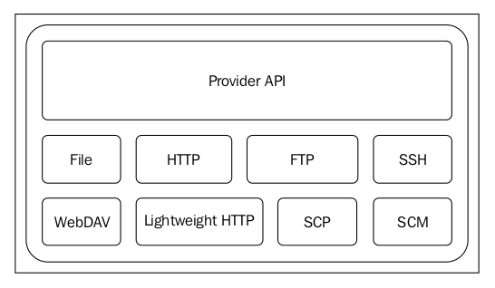

# Maven Wagon

## What is Maven Wagon?

**Maven Wagon** provides a layer of abstraction over **the underlying transport protocols** to transfer resources or artifacts **to** and **from** Maven repositories. 

> 这段话理解的两个意思：  
> （1）Maven Wagon是对多种transport protocols的进一步抽象；  
> （2）Maven Wagon的作用是可以从repo中获取JAR包，或者将JAR包发布到repo中去。

At the time of writing this book, the unified API provided by Maven Wagon has implementations for seven transports. The following figure shows the layered architecture of Maven Wagon:



Due to the decoupled architecture, Maven does not have a hard dependency on the communication protocols supported by the repository. It can be over HTTP, FTP, SSH, WebDAV, or any other custom protocol.

> 虽然这里说Maven Wagon下面包含多种不同类型的协议，但下面要讨论的只有HTTP协议。

More details about Maven Wagon can be found at http://maven.apache.org/wagon/.


## Wagon HTTP(S) transport

From Maven 3.0.4 onwards, Wagon HTTP(S) transport is based on Apache HTTP client 4.1.2. This also added the HTTP connection pooling support. By default, the connection pool size is 20 per destination. Wagon HTTP transport can be further tuned via `settings.xml`.

Maven artifact repositories can be defined in the application POM and will also inherit from **the super POM file**. The super POM file has defined the following repository with the id `central` tag:

```xml
<repositories>
    <repository>
        <id>central</id>
        <name>Central Repository</name>
        <url>http://repo.maven.apache.org/maven2</url>
        <snapshots>
            <enabled>false</enabled>
        </snapshots>        
    </repository>
</repositories>
```

As the connectivity to the repository defined in the previous configuration is over `HTTP`, Wagon will use its HTTP implementation. You can see that the value of the `<url>` element is set to an `HTTP` endpoint.

The Wagon HTTP connection can be configured **per repository** by its `id` via `MAVEN_HOME/conf/settings.xml`. 

### the connection read timeout

If we want to change **the read timeout period** of the HTTP connection to the previous Maven repository with the id `central` tag, add the following child element under the `<servers/>` element. The value of the `<readTimeout>` element defines the timeout period in **milliseconds**. If needed, the timeout can be defined per **HTTP verb**. Here, it's defined only for HTTP `GET`. The value of the `<id>` element must match with what is defined under `<repository>` element in the `pom.xml` file.

```xml
<server>
    <id>central</id>
    <configuration>
        <httpConfiguration>
            <get>
                <readTimeout>100000</readTimeout>
            </get>
        </httpConfiguration>
    </configuration>
</server>
```

**The default read timeout** in **Maven HTTP connection** is **30 minutes**.

### the connection timeout

How about the connection timeout? **The connection timeout** is different from **the connection read timeout**, as discussed before. **The connection timeout** is the waiting time to make the initial connection, while **the connection read timeout** is the waiting time to read data from the connection after it is established. 

> 这段主要是讲两种timeout的区别：  
> （1）the connection timeout;  
> （2）the connection read timeout

The following configuration shows how to change the default connection timeout. The value of the `<connectionTimeout>` element is defined in milliseconds:

```xml
<server>
    <id>central</id>
    <configuration>
        <httpConfiguration>
            <get>
                <connectionTimeout>100000</connectionTimeout>
            </get>
        </httpConfiguration>
    </configuration>
</server>
```

**The default connection timeout** in the **Maven HTTP connection** is **100 seconds**.

### http headers

There can be a case where a remote repository server expects certain **HTTP headers** in the request. To add custom headers, you can have the following configuration:

```xml
<server>
    <id>central</id>
    <configuration>
        <httpHeaders>
            <httpHeader>
                <name>CUSTOM_HEADER_NAME</name>
                <value>CUSTOM_HEADER_VALUE</value>
            </httpHeader>
        </httpHeaders>
    </configuration>
</server>
```

### param

As we discussed before, Wagon HTTP(S) transport is based on Apache HTTP client 4.1.2. Apache HTTP client has many configuration parameters to alter its default behavior. Any of these parameters can be configured in Wagon HTTP transport for Maven, as shown in the following configuration:

```xml
<server>
    <id>central</id>
    <configuration>
        <httpConfiguration>
            <get>
                <params>
                    <param>
                        <name>PARAM_NAME</name>
                        <value>PARAM_VALUE</value>
                    </param>
                </params>
            </get>
        </httpConfiguration>
    </configuration>
</server>
```

### cookie

To ask an HTTP client to ignore cookies for all HTTP GET requests, you need to set
the value of http.protocol.cookie-policy to ignore :

```xml
<server>
    <id>central</id>
    <configuration>
        <httpConfiguration>
            <get>
                <params>
                    <param>
                        <name>http.protocol.cookie-policy</name>
                        <value>ignore</value>
                    </param>
                </params>
            </get>
        </httpConfiguration>
    </configuration>
</server>
```

> 上面的部分是通过在配置文件中修改参数来实现对Wagon HTTP协议的修改；  
> 下面的部分是通过在mvn命令中直接使用system properties参数的方式进行修改

## Wagon system properties

Maven Wagon's default behavior can be altered with the following **system properties**.


### 连接

`maven.wagon.rto` : This shows the connection read timeout in milliseconds. **The default value** is **30 minutes**. The following command shows how to set it:

```bash
$ mvn clean install -Dmaven.wagon.rto=1800000
```

`maven.wagon.http.pool` : This enables or disables the HTTP connection pooling. The default value is true . The following command shows how to set it:

```bash
$ mvn clean install -Dmaven.wagon.http.pool=true
```

### 并发数

`maven.wagon.httpconnectionManager.maxPerRoute` : This specifies the maximum number of HTTP connections that can be created against a given destination/repository. The default value is `20`.

```bash
$ mvn clean install -Dmaven.wagon.httpconnectionManager.maxPerRoute=20
```

`maven.wagon.httpconnectionManager.maxTotal` : This specifies the maximum number of total HTTP connections that can be created against all the destinations/repositories. The default value is `40`. The following command shows how to set it:

```bash
$ mvn clean install -Dmaven.wagon.httpconnectionManager.maxTotal=40
```

### 安全性

`maven.wagon.http.ssl.insecure` : When Maven talks to a server over TLS, it validates whether the server's TLS certificate is signed by a trusted Certificate Authority (CA); if not, it will display an error. By setting this system property to `true`, you can avoid such errors and work with repositories that have self-signed certificates or untrusted certificates. **The default value** is `false`. The following command shows how to set it:

```bash
$ mvn clean install -Dmaven.wagon.http.ssl.insecure=false
```

`maven.wagon.http.ssl.allowall` : By default, when it talks to a TLS endpoint, Maven will check whether the hostname of the endpoint matches the CN (Common Name) value of its certificate. If not, it will display an error. By setting this system property to `true`. you can avoid such errors. **The default value** is `false`. The following command shows how to set it:

```bash
$ mvn clean install -Dmaven.wagon.http.ssl.allowall=false
```

`maven.wagon.http.ssl.ignore.validity.dates` : By default, when it talks to a TLS endpoint, Maven will check whether the expiration date of the certificate is valid. If not, it will display an error. By setting this system property to `true`, you can avoid such errors. The default value is `false`. The following command shows how to set it:

```bash
$ mvn clean install -Dmaven.wagon.http.ssl.ignore.validity.dates=false
```

