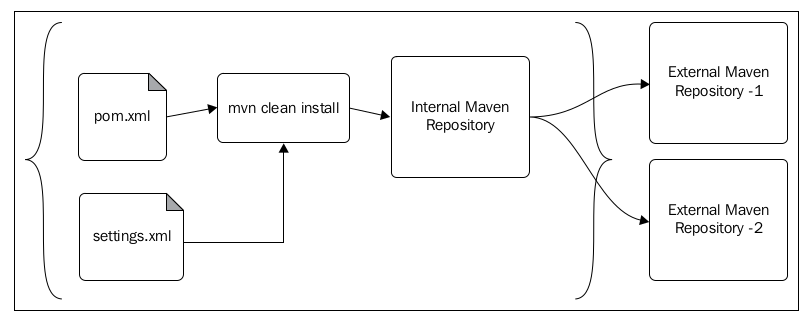

# Mirrored repositories

```xml
<settings>
    <localRepository/>
    <interactiveMode/>
    <usePluginRegistry/>
    <offline/>
    <pluginGroups/>
    <servers/>
    <mirrors/> <!-- 本文是讲这里 -->
    <proxies/>
    <profiles/>
    <activeProfiles/>
</settings>
```

## 1. Concept：mirrored repository （形而上，概念）

**Most of the Maven repositories** maintain a set of **mirrored repositories** to cater to high demand. 

> 一个repository可以有多个mirrored repositories。

Maven repositories are defined in the application `pom.xml` file in a project specific manner. Mirrored repositories are defined outside the application POM, either in `MAVEN_HOME/conf/settings.xml` or `USER_HOME/.m2/settings.xml`. 

> repository，是定义在pom.xml文件中；  
> mirrored repositories是定义在settings.xml文件中。

If Maven finds a corresponding mirrored repository for any given repository defined
in the application POM file, it will start using the mirrored one instead of the primary.

> 如果发现repository有相应的mirrored repository，那么mirrored repository会被使用。

## 2. How: setttings.xml (形而下，如何做)

In a large-scale project, developers can come from every corner of the world, and we cannot define a mirrored repository in the application POM. Each developer can define the most appropriate mirrored repository for him/her in `USER_HOME/.m2/settings.xml` under the `<mirrors>` configuration element.

> 不能将mirrored repository放到pom.xml文件中，是因为如果不同地区的开发者将mirrored repository放到pom.xml文件，就会造成pom.xml文件很混乱。而settings.xml则是属于个人的文件，不会影响到其他人。

```xml
<mirror>
    <id>mirrorId</id>
    <mirrorOf>repositoryId</mirrorOf>
    <name>Human Readable Name for this Mirror.</name>
    <url>http://my.repository.com/repo/path</url>
</mirror>
```

The value of the `<mirrorOf>` element must match the value of the `repository/id` element defined in the application POM file.

In this case, the value of `<mirrorOf>` will be `central`, as follows:

```xml
<repository>
    <id>central</id>
    <name>Central Repository</name>
    <url>http://repo.maven.apache.org/maven2</url>
    <snapshots>
        <enabled>false</enabled>
    </snapshots>
</repository>
```


## 3. Practice: A Simple Example

A given repository can have multiple mirrored repositories in multiple geographical locations, for example, one in the US, one in Europe, and another in Asia. Based on the user's proximity, they can pick the mirrored repository. Due to the same reason, we cannot define it in the application POM file. 

The Maven central repository has **four mirrored repositories** distributed in USA and Europe:

第1个城市：The configuration for the mirrored repository at California, USA, is as follows:

```xml
<mirror>
    <id>Central</id>
    <url>http://repo1.maven.org/maven2</url>
    <mirrorOf>central</mirrorOf>
</mirror>
```

第2个城市：The configuration for the mirrored repository at North Carolina, USA, is as follows:

```xml
<mirror>
    <id>ibiblio.org</id>
    <url>http://mirrors.ibiblio.org/pub/mirrors/maven2</url>
    <mirrorOf>central</mirrorOf>
</mirror>
```

第3个城市：The configuration for the mirrored repository at United Kingdom is as follows:

```xml
<mirror>
    <id>uk.maven.org</id>
    <url>http://uk.maven.org/maven2</url>
    <mirrorOf>central</mirrorOf>
</mirror>
```

第4个城市：The configuration for the mirrored repository at France is as follows:

```xml
<mirror>
    <id>antelink.com</id>
    <url>http://maven.antelink.com/content/repositories/central/</url>
    <mirrorOf>central</mirrorOf>
</mirror>
```

## 5. Advanced mirror configurations

From Maven 2.0.9 onwards, Maven introduced some advanced filtering mechanisms for the `<mirrorOf>` element. **The `*` is for any repository**. 

### 5.1 logic and

The following configuration says use the mirror only for `repo1` and `repo2`:

```xml
<mirror>
    <id>internal.mirror.mycompany.com</id>
    <url>http://internal.mirror.mycompany.com/maven/</url>
    <mirrorOf>repo1,repo2</mirrorOf>
</mirror>
```

### 5.2 logic not

The following configuration says use the mirror for any repository except for the
`central` repository.

```xml
<mirror>
<id>internal.mirror.mycompany.com</id>
<url>
http://internal.mirror.mycompany.com/maven/
</url>
<mirrorOf>*,!central</mirrorOf>
</mirror>
```

###  5.3 external

The following configuration says use the mirror for any repository other than the localhost or file-based repository. 

```xml
<mirror>
    <id>internal.mirror.mycompany.com</id>
    <url>http://internal.mirror.mycompany.com/maven/</url>
    <mirrorOf>external:*</mirrorOf>
</mirror>
```

## 6. The internal corporate repository

In a highly constrained, secured working environment, users won't be able to connect to the Internet directly. 

At the same time, in a larger development environment with hundreds of developers, if each developer tries to download Maven artifacts from external repositories, this will create a great deal of the inbound/outbound Internet traffic. 

This can be avoided by using an internal corporate Maven repository. Each developer has to set **the corporate repository** as **a mirror** in `USER_HOME/settings.xml` for all Maven repositories. 

To indicate that **a given mirror** should be used for **any of the repositories** defined in application POM files, the value of the `<mirrorOf>` configuration element must be set to `*`, as follows:

```xml
<mirror>
    <id>internal.mirror.mycompany.com</id>
    <url>http:// internal.mirror.mycompany.com/maven/</url>
    <mirrorOf>*</mirrorOf>
</mirror>
```

The following figure shows the use of an **internal corporate Maven repository** to
avoid a large amount of inbound/outbound Internet traffic:

