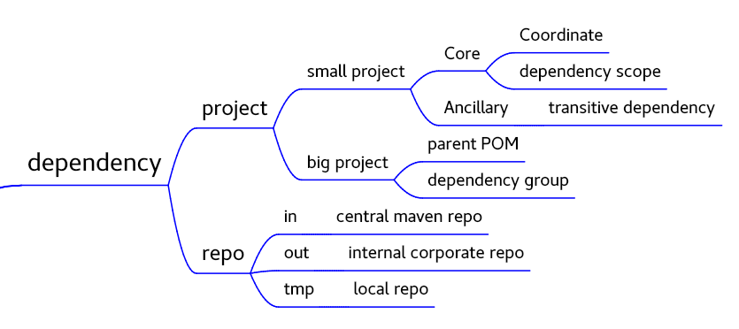

# 关于Dependency的四个知识点

- Dependency Scope 决定JAR包的有效范围（编译、Artifact）
- Transitive Dependency 解决JAR递归依赖的问题
    - Dependency mediation 默认解决JAR包冲突的方式
    - Dependency exclusion 手工解决JAR包冲突的方式
- Optional Dependency 对特殊情况的处理
- Manage POM dependency 对于大项目的管理方式
    - POM inheritance
    - Dependency grouping

Maven Dependency的管理，本质上就是对于JAR包的管理。Maven Coordinate可以唯一的标识JAR包坐标，能够确定需要哪些JAR包，而`Dependency Scope`决定的JAR包的有效范围（compile/provided/runtime/test）。Maven Coordinate和`Dependency Scope`是解决Maven依赖最关键的两个概念。`Transitive Dependency`是于JAR包的层次性依赖提供了一种便利的解决方式，但它本身也导致了一些问题。`Optional Dependency`是对一种特殊情况的处理方式。以上的内容，对于小型项目和大型项目都适应的知识。`Manage POM dependency`是对于大型项目中JAR包两种的管理方法。

`Dependency Scope`决定的JAR包的有效范围（compile/provided/runtime/test），是最基础的功能。即使在没有`Transitive Dependency`的情况下，只有`Dependency Scope`的情况下，也能够完成项目的JAR包依赖管理，但是随着项目依赖的层次越来越多，JAR包的管理会越来越麻烦。

`Transitive Dependency`的出现，就是解决了项目层次依赖的问题，这样就使得项目的JAR包管理起来会非常的容易。凡事都有两面性。`Transitive Dependency`在带来了便利的同时，也同时伴随着另外一些问题的出现：同一个Artifact不同版本之间冲突。这一问题，又衍生出两种不同的解决方案：一种是自动解决，一种是手动解决。`Dependency mediation`是一种Maven提供的一种默认解决Jar包冲突的解决方式，能够很大程度上解决不同JAR包版本的问题。但是还是有一部分无法通过`Dependency mediation`来解决，那么就只能通过手工的方式来解决了，那就是`Dependency exclusion`。

`Optional Dependency`实在是对一种特殊情况下JAR包冲突的处理。其实项目可以分成两个项目来写，完全依赖两个不同版本的JAR包。当非要将两个JAR包放到一起使用的时候，就出现了`Optional Dependency`。

`Manage POM dependency`是对于大型项目的JAR包管理的两种方案，一种方案是使用parent POM继承的方式来处理，另一种是使用dependency group来处理，
