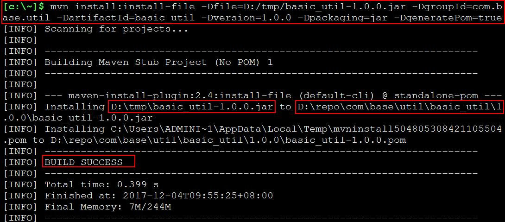

# Maven本地仓库的jar包不是最新的 #

遇到一个问题，就是在本地maven仓库的jar包不是最新的，而公司的私服仓库也没有最新的，那只好将最新的jar包拷贝下来，然后安装到本地的maven仓库中。

使用如下命令：
```mvn
mvn install:install-file -Dfile=D:/tmp/basic_util-1.0.0.jar -DgroupId=com.base.util -DartifactId=basic_util -Dversion=1.0.0 -Dpackaging=jar -DgeneratePom=true
```

其中，
- `-Dfile`：指明新jar包的路径
- `-DgroupId`：指明groupId
- `-DartifactId`：指明artifactId
- `-Dversion`：指明版本version
- `-Dpackaging`：指明packging的方式




