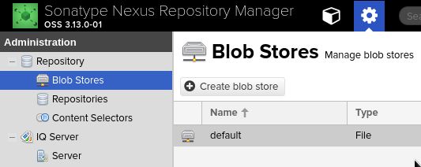

# Configuration

<!-- TOC -->

- [Configuration](#configuration)
    - [Repository Management](#repository-management)
        - [Blob Stores](#blob-stores)
        - [Proxy Repository](#proxy-repository)
        - [Hosted Repository](#hosted-repository)
        - [Repository Group](#repository-group)

<!-- /TOC -->

## Repository Management

URL: https://help.sonatype.com/repomanager3/configuration/repository-management

Repositories are the containers for the components.

> Repository是component的容器。  
> 讲repository和component的关系。

**Creating and managing repositories** is an essential part of **your Nexus Repository Manager configuration**, since it allows you to expose more components to your users. It supports **proxy repositories**, **hosted repositories** and **repository groups** using a number of different repository formats.

> Nexus Repository manager的一个主要部分就是create and manage repsitories。  
> 这段主要是讲Nexus Repository Manager与repsitory之间的关系。

**The binary parts** of **a repository** are stored in **blob stores**, which can be configured by selecting **Blob Stores** from the **Repository** sub menu of the **Administration** menu.

> 这段是讲repository的存储。  
> repository是一个抽象的概念，而存储就需要落实到Disk上。

### Blob Stores

A blob store is the internal storage mechanism for the binary parts of **components** and **their assets**. **Each blob store** can be used by **one or multiple repositories and repository groups**. **A default blob store** that is based on a file system storage within the data directory configured during the installation is automatically configured.

> 首先，什么是blob store呢？它是对于component进行存储的机制。  
> 其次，component和asset是什么关系呢？component是一个抽象的概念，就比如说log4j。log4j名义上是一个组件，其实是一个抽象的概念，它由许多的文件组成，就比如说jar包文件、pom.xml文件等等，而每一个文件就是asset。 
> 第三，每一个blob store可以由多个repository使用。 
> 第四，到底存储在哪儿呢？在`/opt/sonatype-work/nexus3/blobs`目录下有一个`default`文件夹，我猜想，应该就是所说的default blob store。

### Proxy Repository

A repository with the type `proxy`, also known as a **proxy repository**, is a repository that is linked to **a remote repository**. 

> 什么是proxy repository

Any request for a component is verified against the local content of the proxy repository. If no local component is found, the request is forwarded to the remote repository. The component is then retrieved and stored locally in the repository manager, which acts as a cache. Subsequent requests for the same component are then fulfilled from the local storage, therefore eliminating the network bandwidth and time overhead of retrieving the component from the remote repository again.

> 在请求component时，proxy repository以“缓存”方式进行处理

### Hosted Repository

A repository with the type `hosted`, also known as a **hosted repository**, is a repository that stores components in the repository manager as the authoritative location for these components.

> 主要是存放公司内部发布的JAR包。

### Repository Group

A repository with the type `group`, also known as **repository group**, represents a powerful feature of Nexus Repository Manager. They allow you to **combine multiple repositories and other repository groups in a single repository**. This in turn means that your users can rely on a single URL for their configuration needs, while the administrators can add more repositories and therefore components to the repository group.

