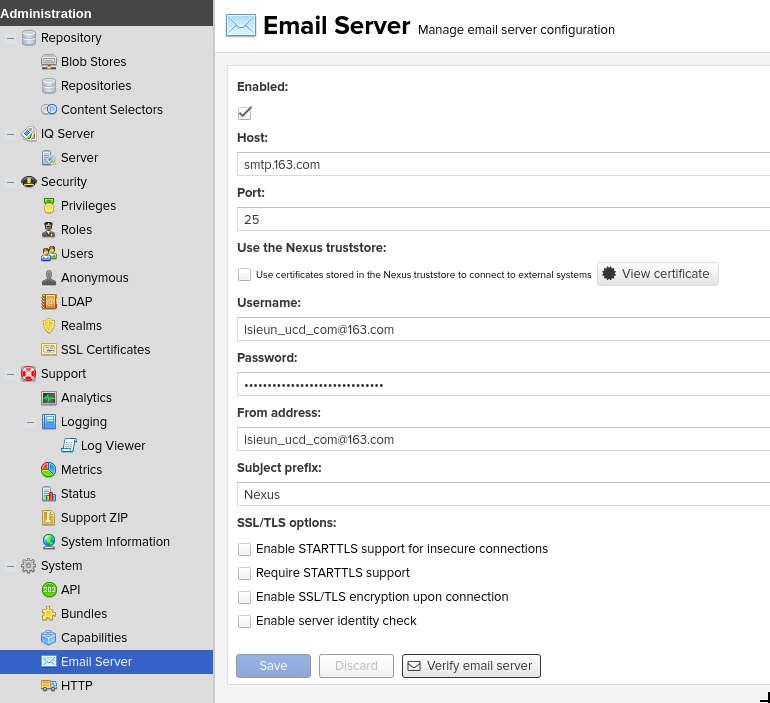

# Admin

## Change default admin password

The default admin `username/password` is `admin/admin123`. Login as admin and change the password to a secure password.

## Anonymous Access

By default Nexus is open to the public. If you want to secure access to nexus, disable ‘Nexus anonymous user’

## SMTP server

It is a good idea to configure SMTP server, so that you can receive emails from Nexus.

## Add a task to periodically remove old snapshots

If you or your CI server publishes snapshots to Nexus several times a day, then you should consider adding a task to delete duplicate/old snapshots for the same GAV (group, artifact, version). If you don’t do this, you will notice that the Nexus disk usage will increase with time.

Admin login -> Left menu -> Administration -> Scheduled tasks -> Add… -> name=”Remove old snapshots”, Repository/Group=Snapshots (Repo), Minimum Snapshot Count=1, Snapshot Retention(days)=3, Recurrence=Daily, Recurring time=2:00 -> click ‘Save’

