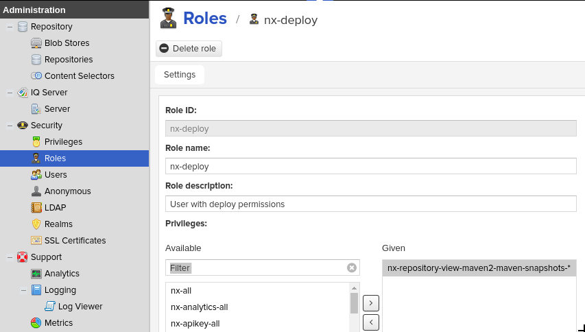
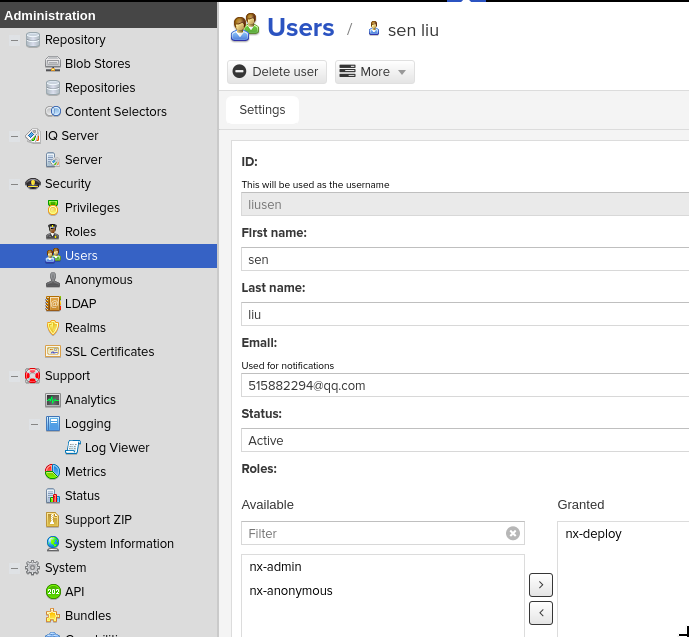

# Deployment user

> "Two wrongs don't make a right."  
> When someone has done something bad to you, trying to get revenge will only make things worse.

<!-- TOC -->

- [Deployment user](#deployment-user)
    - [1. 概念：Repository 和 Component （形而上，两个抽象的概念）](#1-概念repository-和-component-形而上两个抽象的概念)
    - [2. Nexus：权限 （中，Nexus对于权限的实现方式）](#2-nexus权限-中nexus对于权限的实现方式)
    - [3. Nexus：分配权限 （开而下，实践，Practice）](#3-nexus分配权限-开而下实践practice)
        - [3.1 将权限分配给角色](#31-将权限分配给角色)
        - [3.2 将角色分配给用户](#32-将角色分配给用户)
        - [3.3 用户权限测试](#33-用户权限测试)

<!-- /TOC -->

在安装完Nexus 3之后，它默认就提供了admin用户。但是，如果让一个普通开发人员使用admin账号，那会权限太大，可能造成一些误操作。一个较为合理的想法就是，创建一个较低权限的角色，然后分配给特定用户。在[这里](https://stackoverflow.com/questions/40966763/what-is-the-minimal-set-of-privileges-required-to-deploy-artifacts-to-nexus-3)，我找到了解决的方法。

## 1. 概念：Repository 和 Component （形而上，两个抽象的概念）

首先，分清一下这两个概念：Repository 和 Component。

Component，翻译过来是“组件”，它可以表示一个JAR包文件。Repository翻译过来是“仓库”，包含了许多的Component；因此，Repository是一个Component的集合，Repository是比Component更大的概念。

第二，分清不同角色与这两个概念之间的关系。

作为**开发人员**，他进行操作的主要对象是Component。例如，生成一个JAR包，部署一个JAR包，删除一个JAR包。

作为**管理员**（Admin），他进行操作的主要对象是Repository。例如，添加一个仓库，删除一个仓库，修改一个仓库的信息。

第三，得出结论：

在给**开发人员**分配权限的时候，需要分配的权限是与Component有关的权限，而不是与Repository相关的权限。

## 2. Nexus：权限 （中，Nexus对于权限的实现方式）

Nexus提供的权限很多，这里只介绍其中的两个：

- `nx-repository-admin`
- `nx-repository-view`

其中，`nx-repository-admin`是给管理员使用的权限，用于对Repository的管理。  
其中，`nx-repository-view`是给普通用户使用的权限，用于对Component的管理。

> The general rule is `nx-repository-admin` privileges are for administering the repositories and their details; `nx-repository-view` privileges are for use of the repositories once set up. Assign the latter.

> To tweak repository privileges of your Deployment user(s) you should use the `nx-repository-view-*-*-*` as the assigned privilege, instead of `nx-repository-admin`. Since the privilege is denoted with asterisks, your Deployment users can perform all the above actions (i.e. browse, read, edit, add, and delete).

## 3. Nexus：分配权限 （开而下，实践，Practice）

思路：将权限分配给角色，再将角色分配给用户。

### 3.1 将权限分配给角色

将`nx-repository-view-maven2-snapshot-*`权限分配给`nx-deploy`角色。

### 3.2 将角色分配给用户

将`nx-deploy`角色分配给`liusen`用户。

### 3.3 用户权限测试

当`pom.xml`中的`version`为`1.0.0-SNAPSHOT`时，可以发布到NXRM3的`maven-snapshots`仓库；  
当`pom.xml`中的`version`为`1.0.0`时，会报错`ReasonPhrase: Forbidden`，因而不能发布到NXRM3的`maven-releases`仓库。

> 至此结束。

