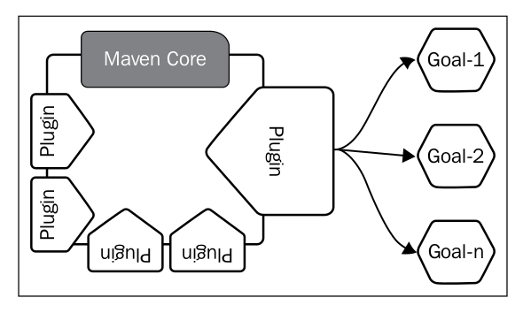

The beauty of Maven is its design. It does not try to do everything itself, but rather delegate the work to a plugin framework. When you download Maven from its website, it's only the core framework and plugins are downloaded on demand. All the useful functionalities in the build process are developed as Maven plugins. You can also easily call Maven **a plugin execution framework**.

## 常用插件

clean生命周期

- maven-clean-plugin [Link](maven-clean-plugin.md)

default生命周期

- maven-compiler-plugin [Link](maven-compiler-plugin.md)
- maven-resources-plugin [Link](maven-resources-plugin.md)
- maven-surefire-plugin [Link](maven-surefire-plugin.md)
- maven-jar-plugin [Link](maven-jar-plugin.md)
- maven-source-plugin [Link](maven-source-plugin.md)
- maven-install-plugin [Link](maven-install-plugin.md)
- maven-deploy-plugin [Link](maven-deploy-plugin.md)
- maven-release-plugin [Link](maven-release-plugin.md)

site生命周期

- maven-site-plugin [Link](maven-site-plugin.md)

其他插件：

- maven-archetype-plugin [Link](maven-archetype-plugin.md)
- maven-dependency-plugin [Link](maven-dependency-plugin.md)
- maven-eclipse-plugin [Link](maven-eclipse-plugin.md)
- maven-help-plugin [Link](maven-help-plugin.md)

## 插件发现与执行

- plugin discovery [Link](plugin-discovery.md)
- plugin execution [Link](plugin-execution.md)
- plugin as an extension [Link](plugin-as-an-extension.md)

## Plugin management and repository

- plugin management [Link](plugin-management.md)
- plugin repository [Link](plugin-repositories.md)

## IOC框架

- Plexus [Link](plexus.md)
- Google Guice [Link](google-guice.md)

## 自定义插件

- 自定义插件 [Link](develop-custom-plugins.md)
- 自定义插件补充 [Link](develop-custom-plugins-extra.md)

